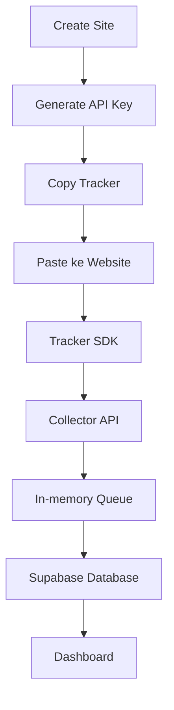

# Pulse Analytics RC4 - Tracking Flow

## Alur lengkap tracking

1. Create Site
2. Generate API Key
3. Copy Tracker
4. Paste ke Website
5. Tracker
6. Collector
7. Queue
8. Supabase
9. Dashboard

## Deskripsi alur
- Create Site: pengguna atau admin membuat site baru dalam dashboard.
- Generate API Key: sistem membuat API key yang digunakan oleh tracker untuk otentikasi terhadap collector.
- Copy Tracker: tracker SDK atau `tracker.js` disediakan untuk disalin.
- Paste ke Website: tracking script dipasang di website klien.
- Tracker: SDK mengirimkan pageview, event, dan heartbeat ke collector.
- Collector: Collector API menerima request, memvalidasi API key dan site, lalu memproses payload.
- Queue: data event dipush ke queue in-memory untuk batch processing.
- Supabase: queue worker mencatat event dan lainnya ke database Supabase.
- Dashboard: data analytics ditampilkan kembali di dashboard.

## Diagram alur

## Catatan penting
- Tracker berfungsi sebagai titik pertama input data
- Collector bertanggung jawab atas validasi dan transformasi payload
- Queue memastikan insert ke Supabase diproses secara batch
- Dashboard adalah konsumen akhir dari data analytics
