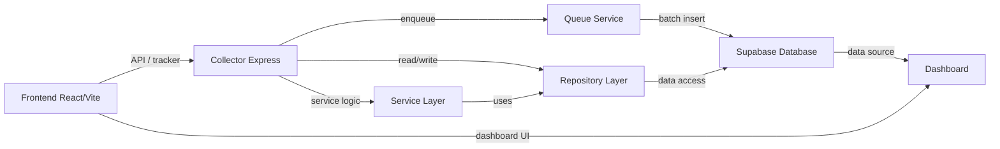

# Pulse Analytics RC4 - Architecture

## Arsitektur keseluruhan
Platform ini dibangun sebagai satu aplikasi terintegrasi dengan beberapa layer.

Frontend
↓
Collector
↓
Queue
↓
Repository
↓
Service
↓
Supabase
↓
Dashboard

## Deskripsi arsitektur
- Frontend: React + Vite menyajikan dashboard dan UI manajemen.
- Collector: Express server menerima request tracker dan melayani endpoint API.
- Queue: antrian in-memory untuk batch processing event ke Supabase.
- Repository: modul akses data yang memisahkan query database dari logika bisnis.
- Service: logika domain yang memproses collector payload, queue metrics, dan analitik.
- Supabase: database dan storage untuk semua data analytics.
- Dashboard: consumer akhir yang menampilkan data dari Supabase.

## Diagram arsitektur

## Catatan arsitektur
- Collector dan Dashboard berada di satu repo, tetapi collector API dan dashboard UI bisa dipisah secara logical.
- Queue in-memory memproses event secara internal; tidak menggunakan external queue service.
- Repository Pattern memastikan query Supabase dikelola dalam satu lapisan terpisah.
- Service Layer memproses logika bisnis, sementara Repository mengurus akses data.
